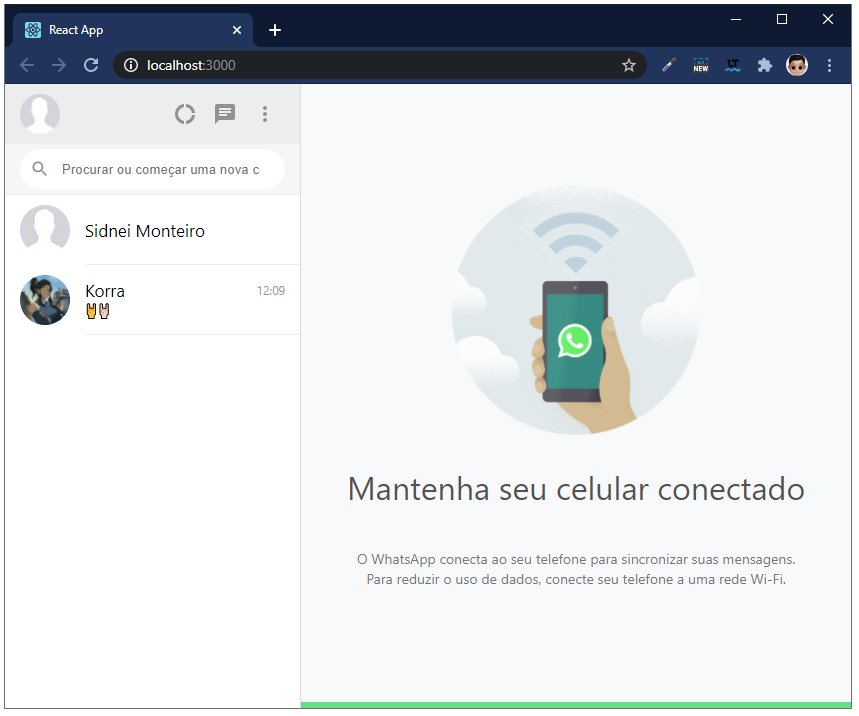
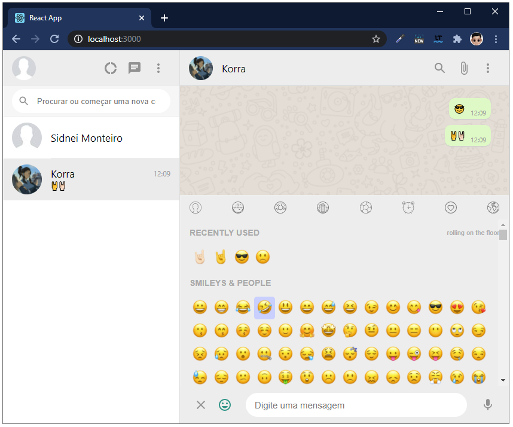
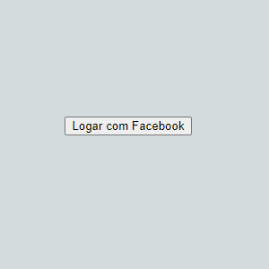
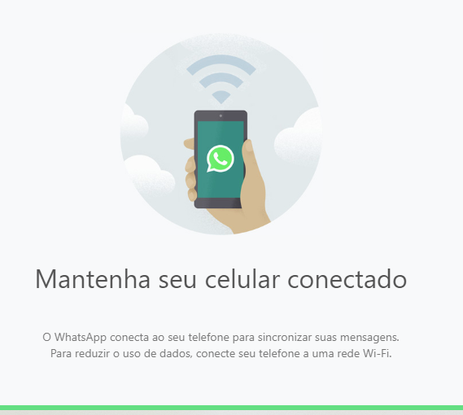
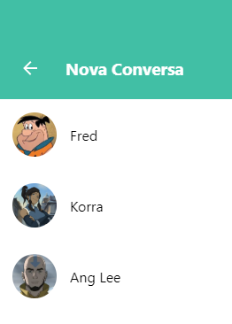
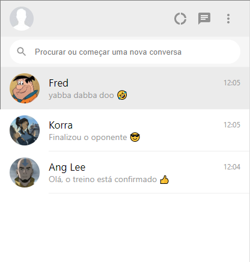
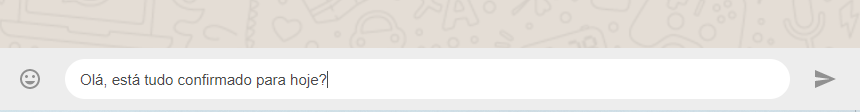
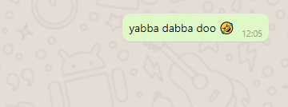

# :fire: Clone do WhatsApp + Firebase em ReactJS

_by Bonieky Lacerda_

> https://www.youtube.com/watch?v=BkX4niTo9Ow

## :computer: Projeto

Este projeto não tem todas as funcionalidades do **WhatsApp**, porem foi bem elaborado pelo Bonieky de tal maneira que ficou fácil o entendimento de componentes e suas propriedades, além de conhecer e utilizar o **Firebase** e autenticação pelo **Facebook**.





## :pushpin: Criando o projeto com React

```bash
$ npx create-react-app whatsappclone
$ cd whatsappclone
$ npm start
```

## :pushpin: Dependências usadas

```bash
$ npm install firebase
$ npm install @material-ui/core @material-ui/icons
$ npm install emoji-picker-react
```

> Ícones usados do **Material Icons** **

https://material-ui.com/components/material-icons/

## :pushpin: Componentes

### :bookmark: Login

Este componente é responsavel por **logar** no sistema. Neste projeto logamos com um usuário do Facebook, a ideia aqui é obter o *nome*, *id* e *avatar* para usar no App.



### :bookmark: ChatIntro

Este componente compõe a o lado esquerdo do App quando não temos nenhum chat.



### :bookmark: NewChat

Este componente é responsavel por listar todos os usuários disponíveis para o chat.



### :bookmark: ChatListItem

Este componente é responsavel por mostrar todas as conversar ativas.



### :bookmark: ChatWindow

Este é o componente responsavel por enviar *Texto* ou *Emoji* para o servidor.



### :bookmark: MessageItem

Este componente é responsavel por mostrar os balões com as conversas.



